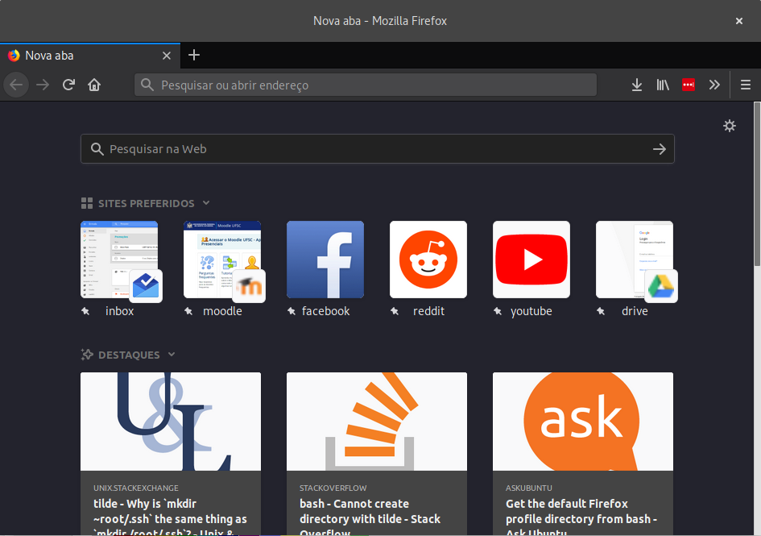
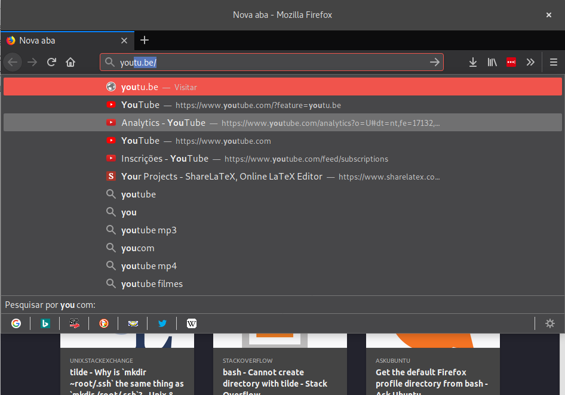
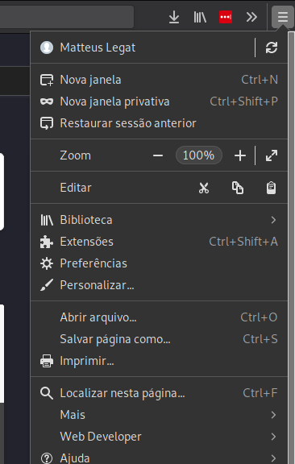

Firefox Full Dark
=================

Dark theme for Mozilla Firefox's elements not themed by Mozilla's default Dark theme.
Complements Firefox's default Dark theme.

Better if used with Mozilla's Dark theme enabled.

Since complete themes do not work with Firefox 57 and higher, this theme uses custom `userChrome.css` and `userContent.css` files that must be imported to your current Firefox profile.

## Themed elements
- AwesomeBar autocomplete popup;
- New Tab / Default Home page;
- Some menu popups;
- Refined find bar (credits to [RavinduL](https://www.reddit.com/r/FirefoxCSS/comments/7fxtdm/refined_find_bar_top_right_aligned_animated/)).

## Installation
### Manual Installation
Copy `chrome` folder to the current active profile directory in Firefox (Profile Directory available in [about:support](about:support) page).

### Install via Script
#### Linux
Linux installation script available.

Just run `bash install_linux.sh`.

#### Windows
Windows installation script is not available (yet).

## Screenshots

## Known Issues
- Downloads, Pocket, Favorites and other popups are not themed;
- about:preferences and about:addons are not themed;
- Title bar is not themed;
- Scrollbar is not themed.
